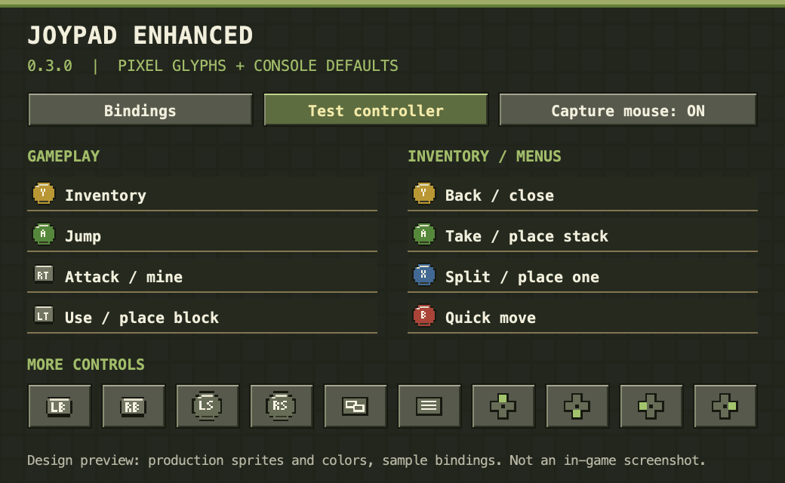

# Joypad Enhanced 0.3.0 — Minecraft 1.7.10

Improved JoypadMod with native **Apple GameController support on macOS 11.3+**, and fixes for XInput controllers on Windows. The macOS JNI library includes Apple Silicon and Intel architectures.

Based on the original JoypadMod by Ljubomir Simin, Andrew Hickey and contributors. Original credits and repository history are preserved. This is an experimental fork, not an official upstream release.

## Install

Download the JAR from [Releases](https://github.com/patodois/MinecraftJoypadSplitscreenMod/releases). Close Minecraft, remove the previous JoypadMod JAR from `mods`, and put the new JAR there. Use Minecraft **1.7.10**, Forge and **Java 8**. Do not install both Joypad versions together. No extra controller library is required on macOS.

Open **Options → Controls**. Select and enable your controller, then use **Test controller** to inspect buttons and axes. On macOS, the device name is prefixed with `macOS -`. The Mac backend is selected automatically and uses its own mapping profile so old JInput axis indexes do not overwrite the standard layout.

Existing settings receive a one-time `.before-enhanced.bak` backup. Keep the previous mod JAR if you want to revert.

## Changes

### 0.3.0: pixel icons, Minecraft colors and console defaults



The image is a design preview rendered with the production sprite artwork and colors, not an in-game screenshot.

- Original pixel-art controller glyphs replace plain input names/numbers in the HUD, binding buttons and controller test screen. Hints read the actual current binding, so custom remaps update their icons immediately.
- Stone-gray beveled buttons, grass-green highlights, warm text and wood-colored accents replace the previous blue theme. Xbox face-button colors remain on the corresponding glyphs.
- Inventory hints now reference the actual menu bindings. Narrow layouts use one bottom row for inventory hints and keep gameplay hints above the hotbar.
- The default layout follows the supplied Controllable 1.12.2 reference for common actions, with Y explicitly extended to go back in menus. See the table below.
- Existing profiles get a one-time migration of recognizable old defaults. Different custom input/output mappings are preserved. Use Reset twice in the settings menu to apply the complete new default profile.

| Control | Gameplay | Menus / inventory |
| --- | --- | --- |
| A | Jump | Select / take or place a stack |
| Y | Open inventory | Back / close using the screen's Escape behavior |
| X | Interact (1.7.10 has no offhand slot) | Split a stack / place one |
| B | Unassigned | Quick move |
| LT / RT | Use item / attack | Unassigned |
| LB / RB | Previous / next hotbar slot | Scroll |
| LS click / RS click | Sprint / sneak | Unassigned |
| View / Back | Player list | Unassigned |
| Start / Menu | Pause | Close / resume |
| D-pad up / down / left | Perspective / drop item / pick block | Unassigned |

The controller test and binding-capture screens suspend gameplay/menu actions so pressing a button can be inspected or assigned safely. Use the mouse or keyboard Escape to leave those modes. Standardized backends use Xbox-style glyphs; unknown legacy layouts use a neutral button icon.

The reference file's numeric button IDs are translated to the physical controls in this mod's backend; its Java classes and textures are not bundled. `tests/GenerateUiAssets.java` generates the original sprite atlas and design preview from `GlyphArt.java` and `PixelTheme.java` during the build.


### 0.2.1: capture the mouse during controller gameplay

The OS cursor is now hidden and captured automatically while a world is active, the game window is focused and controller input is enabled. Inventories, menus and focus loss release the cursor; returning to gameplay captures it again. Mouse movement deltas from the transition are discarded to avoid a camera jump.

The new **Capture mouse** setting defaults to on, including when upgrading a profile whose old `GrabMouse` setting was false. It can be turned off under **Controls → Advanced** for split-screen use. Vanilla mouse release is always honored. The capture state is reconciled each render frame because the old controller handler could set `inGameHasFocus` without grabbing the actual cursor.

### Controller support inherited from 0.2.0

- Native macOS Bluetooth/USB controller support through Apple's GameController framework and a bundled JNI bridge.
- Standard mapping for face buttons, bumpers, stick clicks, D-pad, stick axes and independent LT/RT triggers.
- XInput button polling works for player zero without relying on listener registration order.
- Fix the incorrect negative right-trigger attack threshold and avoid double normalization of XInput trigger values.
- Preserve held D-pad state and prevent held axes from repeatedly firing initial-press actions.
- Bound pending events, release virtual inputs on disconnect, and detect reconnection.
- Reorganized settings with binding and diagnostics tabs, Portuguese translation and separate menu/game sensitivity.
- Keep old custom mappings and standard game/menu contexts; the macOS backend gets a new device profile.

## Validation

- Built using JDK 8 against Minecraft 1.7.10 / Forge 10.13.4.1614.
- 101 input assertions, 19 headless cursor-transition assertions and 38 profile/glyph assertions passed; all 27 generated glyphs stayed inside their atlas cells.
- Patched SRG member references are checked against Minecraft/Forge; the 0.3.0 build also receives the Forge 1558 compatibility check.
- Actual Xbox Wireless Controller detected over Bluetooth on macOS with Apple Silicon, including through the final JAR on Prism's ARM64 Java 8 runtime.
- Tekxit with Forge 10.13.4.1558 started successfully with 130 mods and detected/selected the controller.
- Controller diagnostics in 0.2.0 confirmed that all buttons, both sticks, and LT/RT responded. The native controller backend is unchanged in 0.2.1.
- The 0.3.0 interface artwork was visually inspected in the generated preview. Full in-game visual verification of the new hints and menu layout is still pending.

A successful test was also reported on a **2017 Intel Mac**. Extended gameplay compatibility and Windows hardware still require further testing. Guide/Home may be reserved by the operating system. This is not a complete backport of modern Controlify or Controllable: focus-based console navigation, automatic glyphs, rumble and radial menus are outside this release.

## Build

Requirements: Python 3.8+, curl, **JDK 8**, and the exact original `JoypadMod-1.7.10-10.13.4.1614-1.7.10.jar`. Set `JAVA_HOME` to the JDK.

```sh
python3 build.py --original /path/to/JoypadMod-1.7.10-10.13.4.1614-1.7.10.jar
```

On Windows, use `python` and a Windows path. The result is written to `dist/`. `build-lock.json` pins dependency downloads and the original JAR checksum. The original JAR is a required build input, not fetched automatically or committed here.

The complete historical source tree is retained. `patch-manifest.json` identifies the classes and resources replaced in this release. The reproducible patch build compiles those classes against actual Minecraft/Forge types, tests them, remaps MCP names to runtime SRG names with the full class hierarchy, and replaces only the specified entries in the original JAR. Minecraft/Forge build classes and test fixtures are not added to the mod. Libraries already bundled in the original JAR are preserved.

The old `build.gradle` is retained for historical context; use `build.py` for this release.

### Native bridge

`native/MacGamepad.m` is the source of the bundled macOS bridge. To rebuild it on macOS with Xcode and JNI headers:

```sh
python3 build_native.py
python3 build.py --original /path/to/original.jar
```

Other hosts can reuse the universal native binary in `src/main/resources/natives/macos/`. `tests/MacPhysicalProbe.java` exercises the real backend with a connected controller and is deliberately separate from the simulated regression suite.

## Credits

Original project: [ljsimin/MinecraftJoypadSplitscreenMod](https://github.com/ljsimin/MinecraftJoypadSplitscreenMod), branch `1.7.10` (base commit `944aa55c75092cb618f6c964056203a050e4a568`). Original mod authors and dependency credits are preserved. The additional implementation is maintained in this fork. No new blanket license is asserted over the original project or its bundled dependencies.
